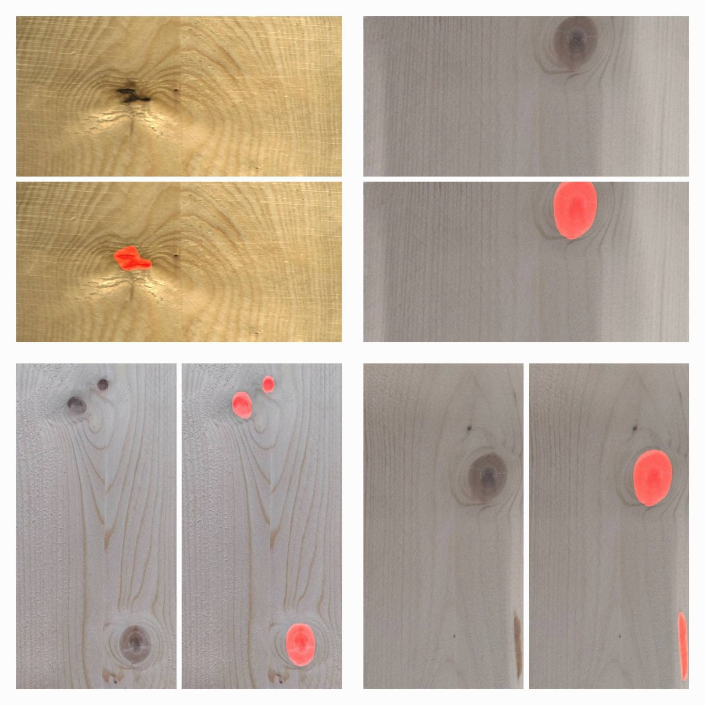
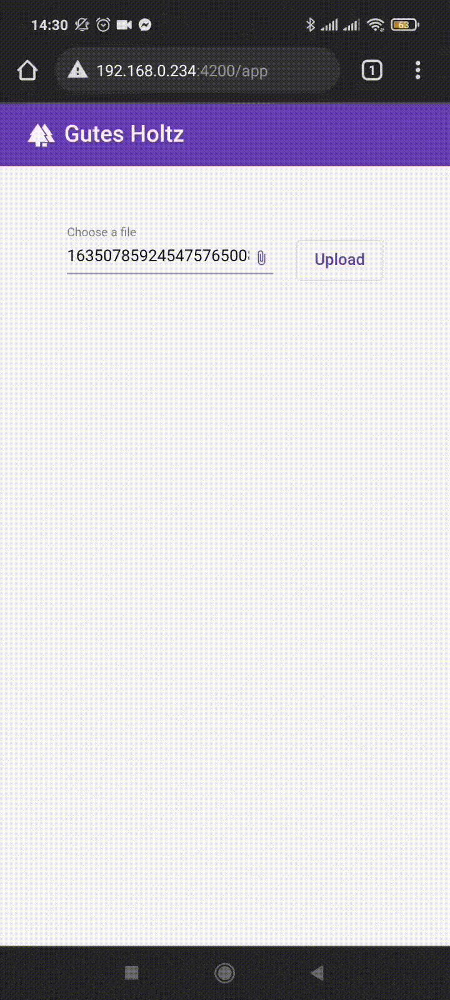
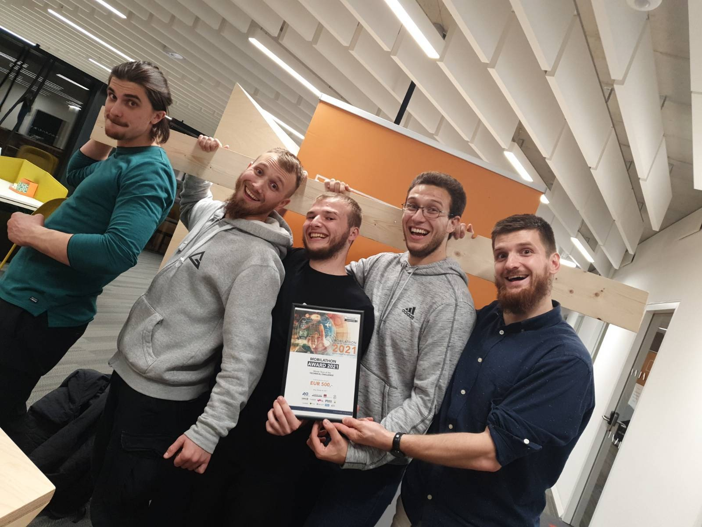

# Techhouse-Hackaton-Backend
This Python web application, developed during the Techhouse Mobilathon Hackathon 2021, leverages Flask and computer vision libraries to perform image segmentation on plank images, identifying and masking defects. The project, which includes this backend script, a frontend, and a machine learning model, clinched the 1st place in the technical challenge category.

# How to use
## Prerequisite
Make sure you have Conda installed. If not, you can download and install it from <a href="https://docs.conda.io/projects/conda/en/latest/user-guide/install/windows.html">conda.io</a>

Install a conda enviroment with python3.8

    conda create -n gutes_holz python=3.8 anaconda

Acivate the conda enviroment with

    conda activate gutes_holz

Install the dependences with:

    pip install -r requirements.txt

Install Segmentation-Models with:

    pip install -U segmentation-models

Start Flask server with:

    python App.py

Connect to the server with the browser:

    localhost:8000
    
# Example Outputs
Here are some example outputs generated by the model:

# Credits

## AI Modell and research
Most of the AI training and research for this project was conducted by our talented team members:
<a href="https://github.com/hal3e">@hal3e</a>,
<a href="https://github.com/MujkicA">@MujkicA</a> and
<a href="https://github.com/enizimus">@enizimus</a>

## Frontend
Here is a GIF of the frontend written by <a href="https://github.com/Salka1988">@Salka1988</a>:

The frontend and the ML training scripts are not included in this repository. If you are interested in exploring the frontend or the machine learning code, please feel free to contact our team members. There is a very basic frontend written by me just for testing. You can connect to it after you start the script and go to <a href="localhost:8000">localhost:8000</a>.

At last here is a image of the whole team that participated on the hackaton.

# Additional Insights

For more insights into the development process, check out these LinkedIn posts by <a href="https://github.com/hal3e">@hal3e</a>:

<a href="https://www.linkedin.com/posts/halil-beglerovi%C4%87-596434127_innovation-coderlife-hackathon-activity-6857045602291765248-oyIM?utm_source=share&utm_medium=member_desktop">1.Link</a>

<a href="https://www.linkedin.com/posts/halil-beglerovi%C4%87-596434127_after-36-hours-of-hard-work-and-only-3-hours-activity-6857596537405505536-0UFR?utm_source=share&utm_medium=member_desktop">2.Link</a>

<a href="https://www.linkedin.com/posts/halil-beglerovi%C4%87-596434127_in-this-post-i-will-tell-you-more-about-activity-6858359395009499136-R-nz?utm_source=share&utm_medium=member_desktop">3.Link</a>

<a href="https://www.linkedin.com/posts/halil-beglerovi%C4%87-596434127_the-third-task-in-the-mobilathon-was-a-creative-activity-6858361759070208000-7R8M?utm_source=share&utm_medium=member_desktop">4.Link</a>

