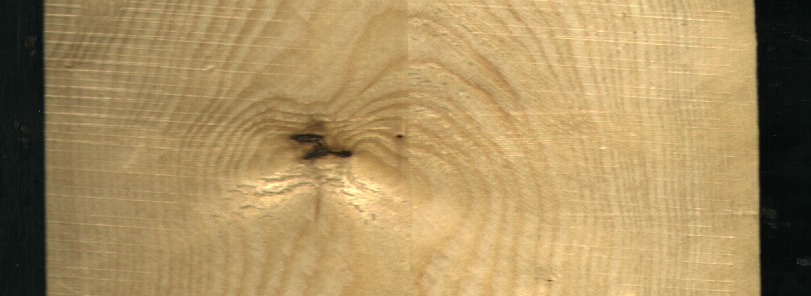
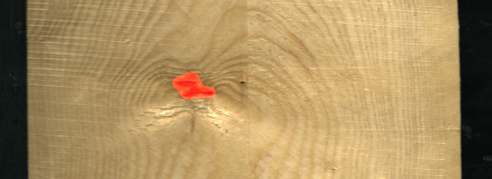
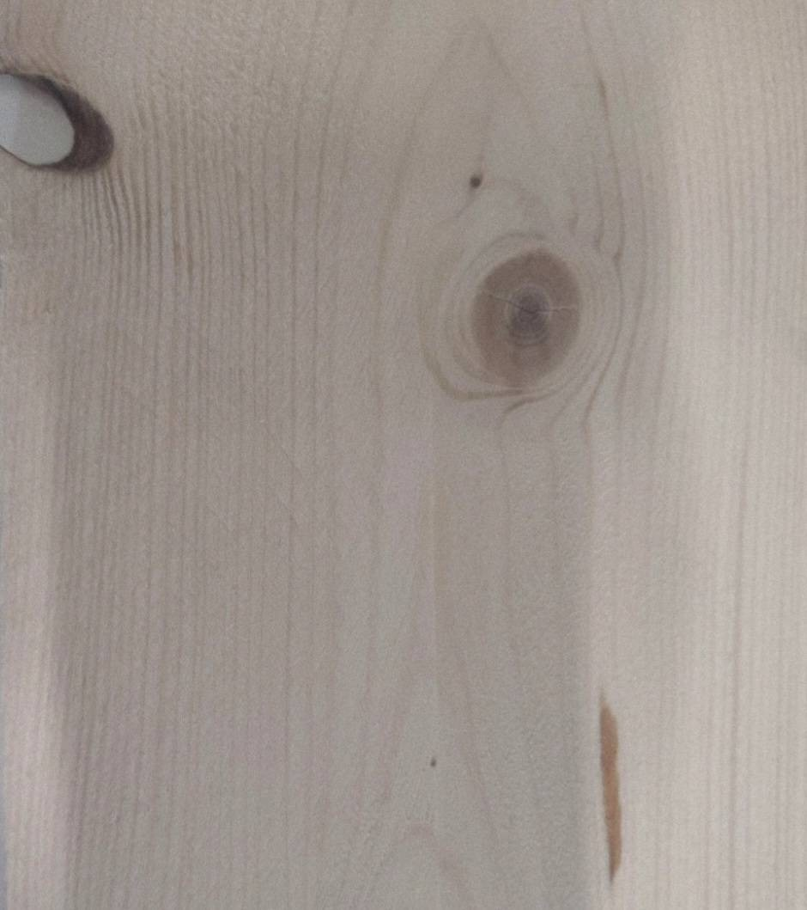
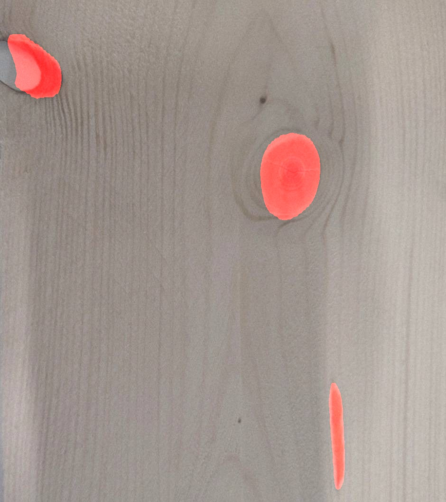
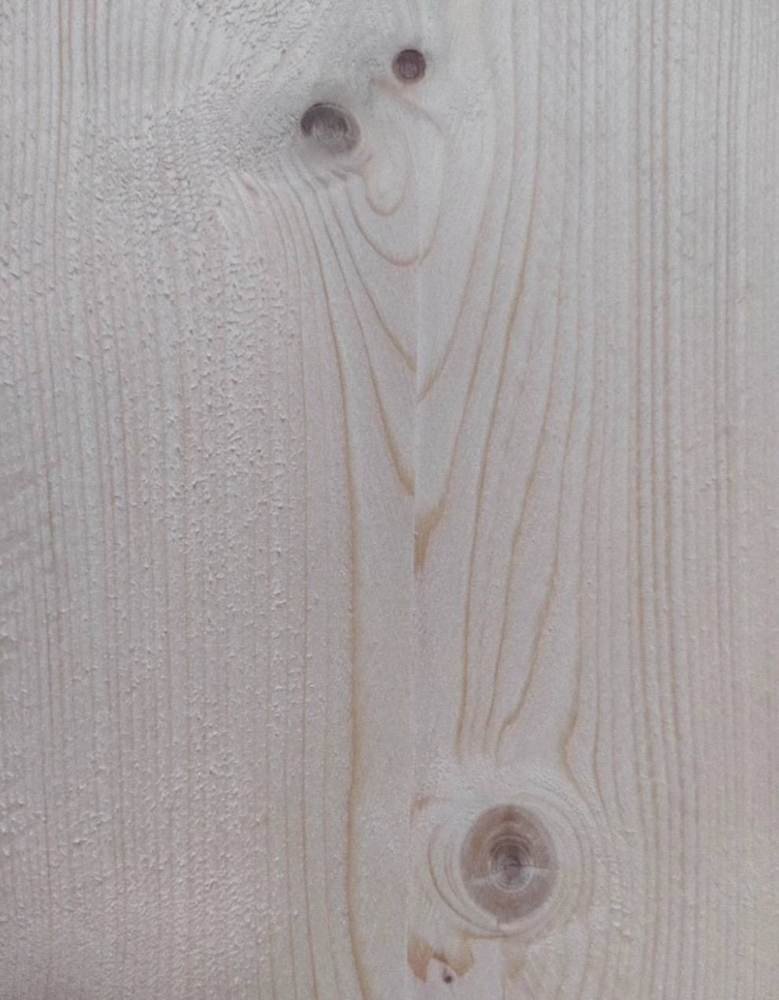
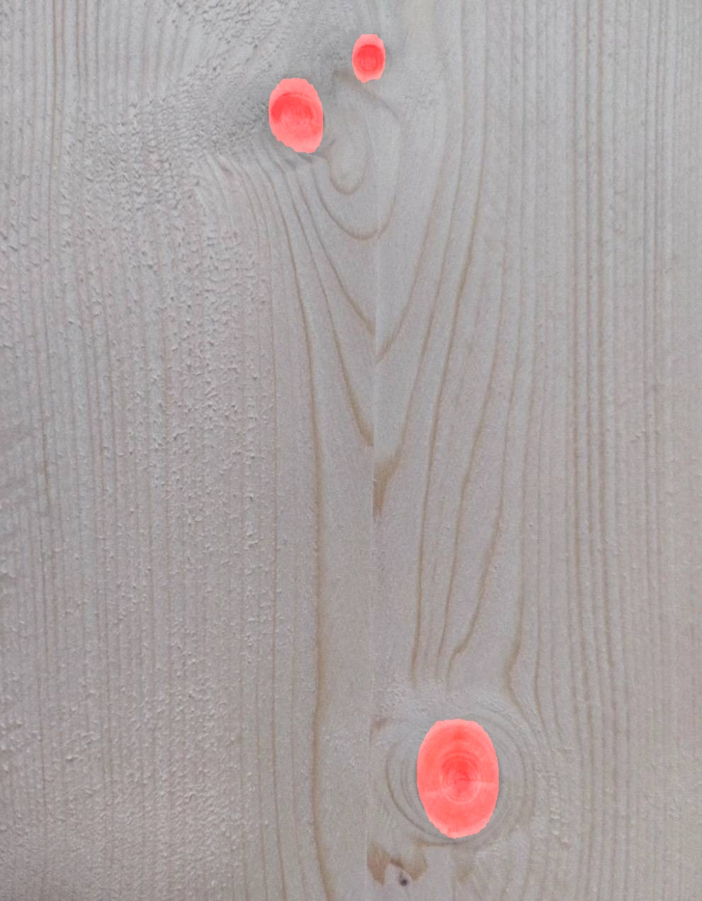

# Techhouse-Hackaton-Backend
This script is a Python web application using Flask and some computer vision libraries to perform image segmentation on an input image of a plank to identify and mask defects.

# How to use
Install a conda enviroment with python3.8

    conda create -n gutes_holz python=3.8 anaconda

Acivate the conda enviroment with

    conda activate gutes_holz

Install the dependences with:

    pip install -r requirements.txt

Install Segmentation-Models with:

    pip install -U segmentation-models

Start Flask server with:

    python App.py

# Here are some example outputs from the model:
## 1. Input

## 1. Output

## 2. Input

## 2. Output

## 3. Input

## 3. Output

